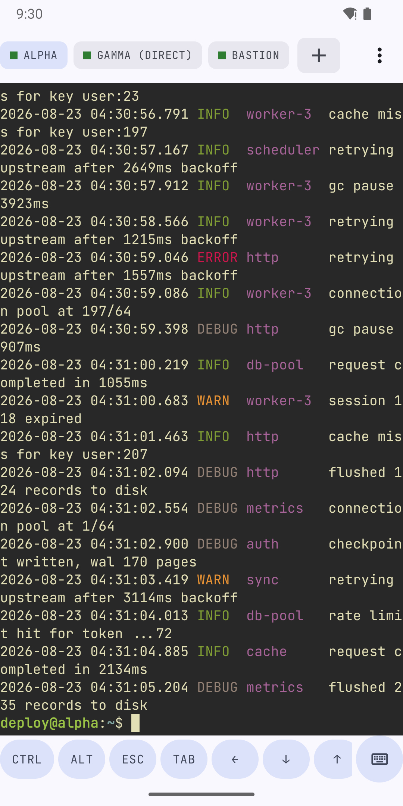
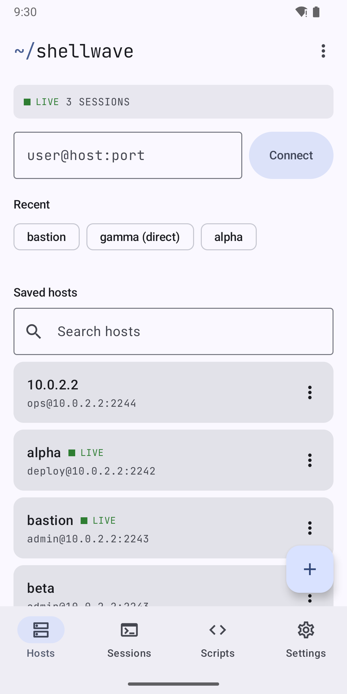
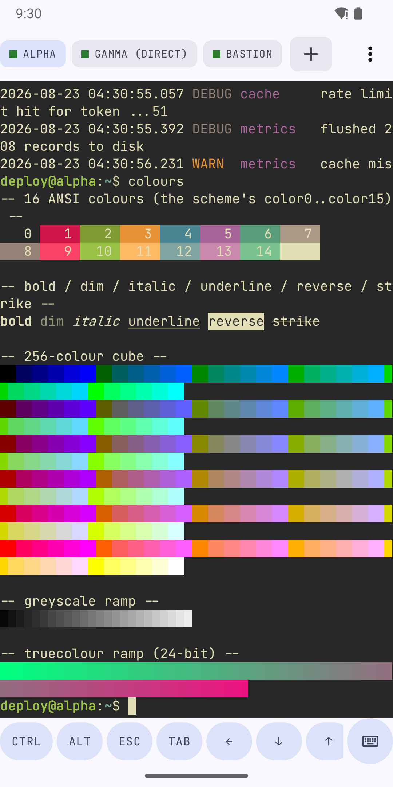
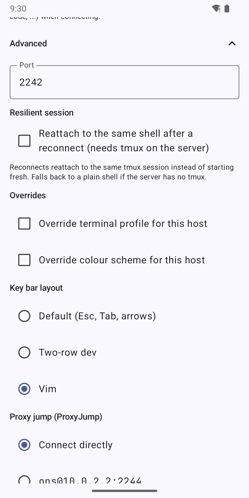
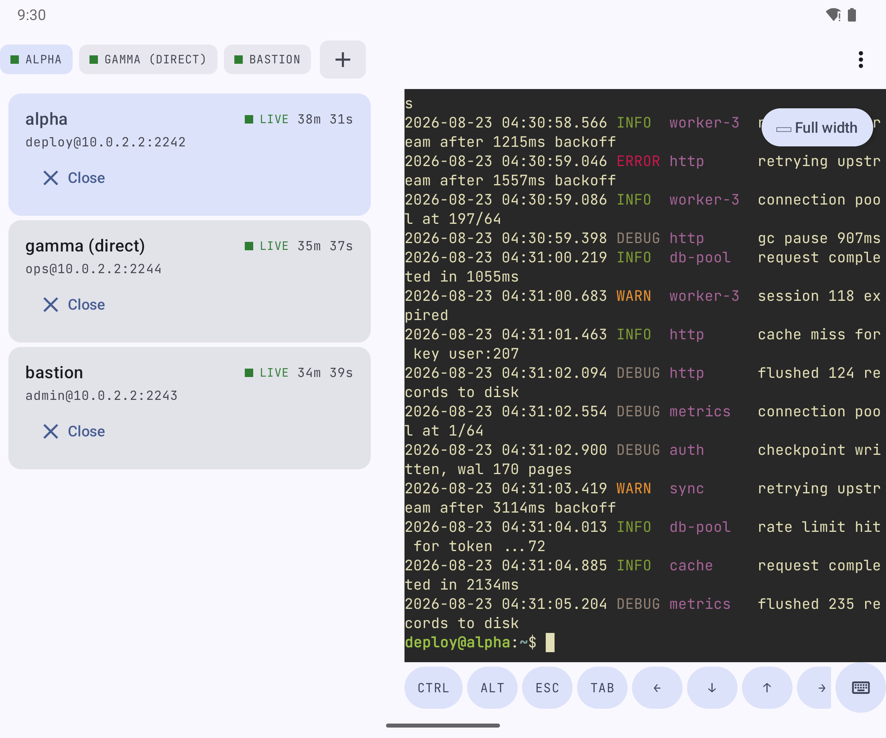
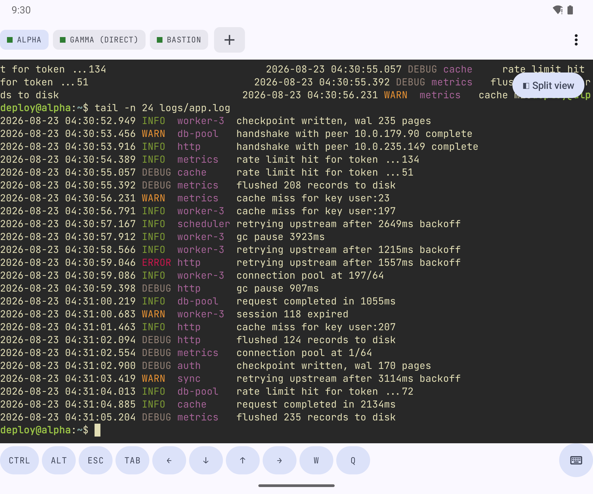

<h1 align="center">
  
  <br>
  ~/Shellwave
</h1>

<p align="center">
  An SSH client for Android, using the terminal emulator from
  <a href="https://github.com/termux/termux-app">Termux</a> for VT rendering.
  <br>
  Requires Android 12 (API 31) or later. GPLv3.
</p>

## Screenshots

<p>
  
  
  
  
</p>

Unfolded, the session list and the terminal share the screen; collapsing the split gives the
terminal the full width.

<p>
  
  
</p>

## Features

- 256-colour and truecolour output, wide characters, alternate screen.
- Password, private key (imported or generated on device), and keyboard-interactive auth.
- Host key verification on first connect, with the fingerprint shown. A changed key blocks the
  connection.
- Credentials encrypted with the Android Keystore, hardware-backed where available, with an
  optional biometric unlock per credential.
- Key enrolment: generate a key, install it in the host's `authorized_keys`, replace the saved
  credential.
- Local and remote port forwarding, SOCKS5, ProxyJump chaining, `~/.ssh/config` import.
- SFTP upload and download.
- Saved scripts, run from the app, a widget, an app shortcut, a Quick Settings tile, or another app.
- Optional `tmux`-backed sessions that reattach after a reconnect.
- Per-host terminal profile, colour scheme and key bar layout, each overriding a global default.
- No analytics

## Terminal engine

`:terminal-core` contains twelve files from termux-app's `terminal-emulator` module, ten of them
byte-identical to upstream. `TerminalRenderer.kt` in `:app` is a Kotlin port of upstream's
`TerminalRenderer.java`. The package is left as `com.termux.terminal` so the vendored files stay a
mergeable diff.

`terminal-core/VENDORING.md` records the upstream commit, the file list and the edits made. The
engine's pty/JNI subprocess code is not used; sessions are remote shells over SSH.

Third-party attribution lives in `NOTICE`, which a Gradle task copies into `res/raw` for the in-app
licence screen.


## Downloading 

APKs are generated through a Github action for each release ~ download here: https://github.com/LordOfPolls/Shellwave/releases

## Building

Two product flavours, identical but for one dependency:

```
./gradlew assembleFossRelease   # no proprietary dependencies - the F-Droid build
./gradlew assemblePlayRelease   # adds Play Billing, for the optional one-time tip
```

`SupporterBilling` is an interface in `:app`'s main source set with one implementation per
flavour, so only `play` links `com.android.billingclient`. 
On `foss` the Support section of Settings does not exist.

## Licence

GPLv3 - see `LICENSE`. The vendored terminal engine is GPLv3 from termux-app; `NOTICE` has the
details.
